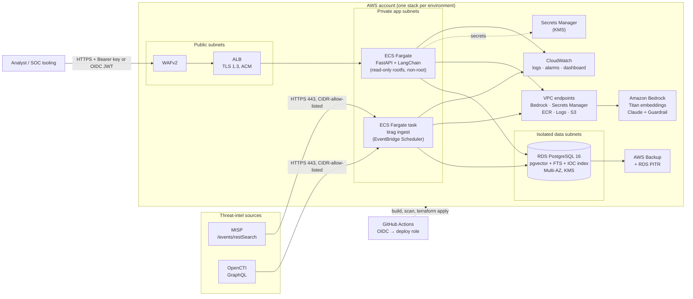
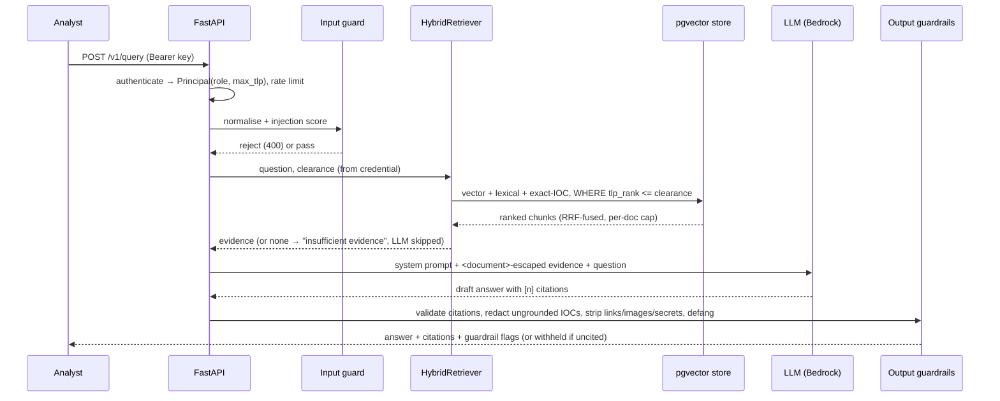

# Secure RAG for Threat Intelligence

A retrieval-augmented generation service that lets security analysts ask natural-language questions of
their **MISP** and **OpenCTI** data and get **grounded, cited** answers — with TLP clearance enforced
inside the datastore, prompt-injection and data-exfiltration controls around the LLM, and an AWS
deployment defined as code.

`Python 3.11` · `FastAPI` · `LangChain (LCEL)` · `PostgreSQL + pgvector` · `Amazon Bedrock` · `Docker` ·
`Terraform` · `GitHub Actions (OIDC)`

## Status — what is real and what is not

This repository was built and verified in a sandbox **without** access to GitHub, AWS, Docker or a live
MISP/OpenCTI. The table is deliberately blunt.

| Area | State |
|---|---|
| Application (ingestion, chunking, embeddings, hybrid retrieval, guardrails, API, CLI) | **Implemented and tested** |
| Test suite | **258 tests**, 94.6 % line+branch coverage, run against a real PostgreSQL + pgvector (embedded) |
| MISP / OpenCTI connectors | Implemented against the documented API shapes and tested against **mock servers**; **never run against a live MISP or OpenCTI** |
| Embeddings / LLM | `hash` embedder and `extractive` answerer are **offline stand-ins** for tests/CI/demo (not semantic, not generative). The Bedrock providers are implemented and unit-tested with fakes; **never exercised against real Bedrock** (`tirag eval --live` is provided for that) |
| Dockerfile / compose | Written; **never built** (no Docker daemon in the build sandbox). CI builds, scans and smoke-tests the image |
| Terraform (AWS) | Written; passes a custom reference checker and Checkov (570 passed / 0 failed / 34 documented skips). **Never `terraform validate`d, planned or applied** (no Terraform binary or AWS access) |
| GitHub Actions | Written; pass `actionlint` and Checkov; **never run** (repository not yet on GitHub) |
| Deployment to AWS | **Not deployed.** See `docs/deployment.md` for the exact prerequisites |

## Architecture



### Query path (what happens to one question)



Key design decisions (full rationale in `docs/architecture.md`):

* **One database.** PostgreSQL with `pgvector` holds vectors, full-text and an IOC array index, so hybrid
  retrieval needs no second service and TLP filtering is a SQL `WHERE` clause on every channel.
* **Hybrid retrieval with Reciprocal Rank Fusion.** Exact IOC matches (weight 3), BM25-style lexical and vector similarity are fused; an IDF-weighted concept-overlap gate refuses to answer when evidence is weak.
* **TLP 2.0 is a hard filter, not a prompt instruction.** Clearance comes from the credential (API-key `max_tlp` or an OIDC claim), never from the request.
* **ECS Fargate, not Kubernetes.** One stateless service and one scheduled job do not justify a cluster to operate.
* **The model gets no tools** and only sees escaped, delimited evidence.

## Quickstart (local, no cloud, no credentials)

```bash
python3.11 -m venv .venv && . .venv/bin/activate
pip install --require-hashes -r requirements-dev.txt && pip install --no-deps -e .

export TIRAG_MEMORY_INDEX_PATH=.data/index.json      # in-memory store persisted to a JSON file
tirag ingest --source fixtures                       # loads the synthetic, fictional demo data
tirag ask "What infrastructure does STORMVEIL use for command and control?" --tlp AMBER

tirag keygen --name alice --role analyst --max-tlp AMBER   # prints a key ONCE + a config entry
export TIRAG_API_KEYS_JSON='[{"name":"alice","sha256":"…","role":"analyst","max_tlp":"AMBER"}]'
export TIRAG_AUTH_MODE=apikey
tirag serve                                          # http://127.0.0.1:8080  (docs at /docs in dev)
```

```bash
curl -s localhost:8080/v1/query -H "Authorization: Bearer $KEY" -H 'Content-Type: application/json' \
  -d '{"question":"Which indicators are linked to NIGHT KESTREL?","top_k":6}' | jq
```

The demo data (`src/tirag/fixtures`) is entirely fictional: RFC 5737 IP addresses, `example.*` domains,
`CVE-2099-*` identifiers and invented actor names.

### Full local stack with PostgreSQL + pgvector

```bash
cp .env.example .env            # set TIRAG_DB_PASSWORD (compose refuses to start without it)
docker compose -f docker/docker-compose.yml up --build -d db api
docker compose -f docker/docker-compose.yml --profile demo run --rm ingest-fixtures
docker compose -f docker/docker-compose.yml --profile feeds up -d mock-feeds   # HTTP mock MISP/OpenCTI
```

### Connecting real feeds

```bash
export TIRAG_MISP_URL=https://misp.example.org TIRAG_MISP_API_KEY=…      # read-only automation key
export TIRAG_MISP_TRUSTED_ORGS="MY-CSIRT,PARTNER-ISAC"                   # poisoning allow-list
export TIRAG_OPENCTI_URL=https://opencti.example.org TIRAG_OPENCTI_TOKEN=…
tirag ingest --source all          # incremental (stored cursor, 10-minute overlap); --full to re-read
```

## API

| Method & path | Role | Purpose |
|---|---|---|
| `POST /v1/query` | analyst, admin | Cited, grounded answer. Body: `question` (3–2000 chars), optional `top_k`, `doc_types`, `sources` |
| `POST /v1/search` | analyst, admin | Retrieval only (same filters and clearance), no LLM |
| `GET /v1/stats` | analyst, admin | Index statistics visible to the caller |
| `GET /healthz`, `GET /readyz` | none | Liveness; readiness (database ping) |
| `GET /metrics` | admin | Prometheus metrics |

Responses carry `request_id`, `grounded`, `citations[]` (chunk, source, TLP, link, excerpt),
`flags[]` (guardrail events) and `latency_ms`. Errors: `400` input policy, `401/403` auth, `413`
oversized body, `422` validation, `429` rate limit, `502` upstream (LLM/DB). Indicators in answers are
**defanged** by default (`198[.]51[.]100[.]23`).

## Configuration

All settings are `TIRAG_*` environment variables (`src/tirag/config.py`, `.env.example`). Highlights:

| Variable | Default | Notes |
|---|---|---|
| `TIRAG_ENV` | `dev` | `staging`/`prod` enable guard-rails: no disabled auth, pgvector required, TLS verification on, no query text in logs, defanging on |
| `TIRAG_STORE_BACKEND` | `memory` | `pgvector` in staging/prod |
| `TIRAG_DB_HOST/_USER/_PASSWORD/_SSLMODE/_SSLROOTCERT` | — / `require` | password comes from Secrets Manager in AWS |
| `TIRAG_EMBEDDING_PROVIDER` / `TIRAG_EMBEDDING_DIM` | `hash` / 384 | `bedrock` + 1024 in AWS (Titan v2) |
| `TIRAG_LLM_PROVIDER` / `TIRAG_LLM_MODEL_ID` | `extractive` | `bedrock` or `anthropic` for real generation |
| `TIRAG_BEDROCK_GUARDRAIL_ID/_VERSION` | — | optional managed guardrail on every model call |
| `TIRAG_AUTH_MODE` | `apikey` | `oidc` (RS256/ES256 via JWKS) or `disabled` (dev only) |
| `TIRAG_API_KEYS_JSON` | `[]` | list of `{name, sha256, role, max_tlp, expires}` — hashes only |
| `TIRAG_RATE_LIMIT_PER_MINUTE` / `_BURST` | 30 / 10 | per principal, per replica |
| `TIRAG_MISP_*`, `TIRAG_OPENCTI_*` | — | URL, credential, TLS verify, lookback, page size, trusted orgs |

## Security at a glance

Identity & access (API keys as SHA-256 + constant-time compare, OIDC, roles, TLP ceiling per credential),
network (private subnets, security-group-to-security-group rules, VPC endpoints, WAF, TLS 1.3), data
(KMS everywhere, `verify-full` TLS to RDS, no query text in logs), application (strict schemas, body
limits, rate limits, secure headers, docs off in prod), supply chain (hash-locked deps, pinned Actions,
immutable image tags, scans) and AI-specific controls (injection scoring on queries *and* ingested
chunks, delimiter escaping, no tools, citation enforcement, ungrounded-IOC redaction, link/image
stripping, defanging). Details: `docs/security.md`, `security/threat-model.md`.

## Verified results (sandbox)

| Check | Result |
|---|---|
| `pytest` (unit, API, AI-security, pgvector integration, mock-feeds HTTP) | 258 passed |
| Coverage | 94.6 % (gate: 85 %) |
| `tirag eval` (25 golden cases, offline stand-ins) | hit-rate@8 = 1.00, MRR = 0.82, TLP leaks 0, poison leaks 0, injection block rate 1.00, refusal accuracy 1.00 |
| `scripts/smoke_test.py` against a live uvicorn + pgvector server | 16/16 checks |
| `scripts/loadtest.py` (800 requests, extractive LLM, 30-chunk corpus) | 0 errors; query p95 ≈ 0.34 s, search p95 ≈ 0.58 s — sandbox numbers, **not** representative of Bedrock |
| `ruff`, `bandit`, `pip-audit` | clean |

The evaluation set is small and was used while tuning; treat it as a regression gate.

## Repository layout

```
src/tirag/            application (api/, rag/, ingest/, connectors/, store/, security/)
tests/                unit/, security/, integration/ (embedded PostgreSQL)
eval/golden_set.json  retrieval / safety evaluation cases
docker/               Dockerfile (hardened, multi-stage), docker-compose.yml
infrastructure/terraform/   root stack, modules/, environments/*.tfvars, bootstrap/ (state + OIDC)
.github/workflows/    ci, codeql, deploy (staging → prod), rollback
monitoring/           signals, alarms, SLOs;  security/threat-model.md
docs/                 architecture, deployment, security, operations, troubleshooting, disaster-recovery
scripts/              smoke_test, loadtest, fixture generator, Terraform reference checker
tools/                HTTP mock of MISP + OpenCTI
```

## Deploying

Short version (full runbook: `docs/deployment.md`): apply `infrastructure/terraform/bootstrap` once with an
administrator identity → create the `staging` and `prod` GitHub environments and set the variables the
runbook lists → merge to `main`. CI runs, the image is built and scanned once, deployed to staging, verified,
then waits for approval before production. Rollback: re-run the **Rollback** workflow with a previous tag.

Prerequisites you must supply: an AWS account with Bedrock model access enabled, a domain name (and
Route 53 zone or an ACM certificate), the CIDR ranges allowed to reach the API, feed URLs/credentials, and the
GitHub repository.

## Cost considerations

No prices are quoted here because they change; the drivers, largest first, are: NAT gateways (one per AZ in
prod), RDS instance + Multi-AZ + storage, the interface VPC endpoints (billed per endpoint per AZ and per
GB), ALB hours + LCUs, Fargate vCPU/GB-hours (API ×2 minimum, plus short ingest runs), Bedrock tokens
(answers) and embedding calls (ingest — incremental sync keeps this small), CloudWatch log ingestion and
retention, WAF (web ACL + rules + requests), KMS keys and Secrets Manager secrets. Levers: `nat_gateway_count = 1`,
smaller RDS class / single-AZ for staging (already the staging default), `log_retention_days`, the ingest
schedule, `top_k` and `llm_max_tokens`. See `docs/operations.md`.

## Known limitations

See `docs/security.md` and `security/threat-model.md`. In short: heuristic injection detection, small eval
set, connectors untested against live systems, Bedrock path unevaluated, application uses the RDS master
credential, per-replica rate limiting, no tracing, broad Terraform deploy role (mitigated, not eliminated).

## License

MIT — see `LICENSE`.
